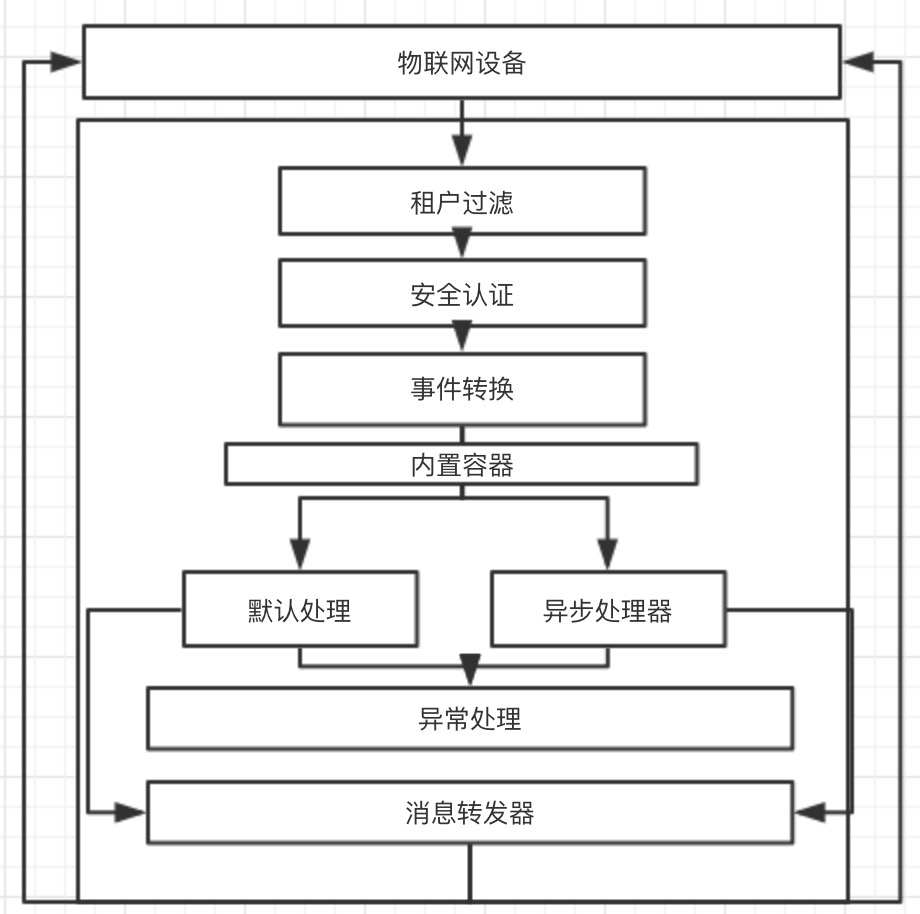
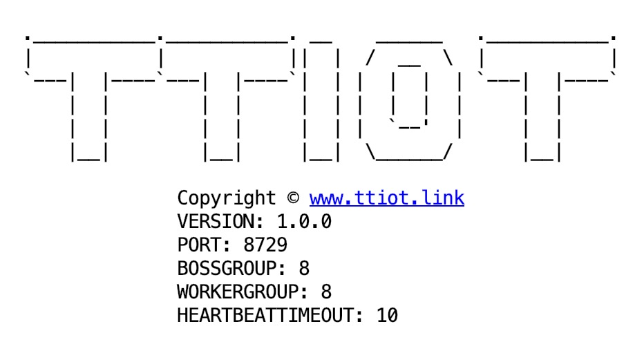

<p align="center">
	
</p>
<p align="center">
	<strong>TTIoT云端物联网组件;面向JAVA;以事件为驱动;为设备提供安全可靠的连接通信能力</strong>
</p>
<p align="center">
	<a>
		</img>
	</a>
	<a target="_blank" href="https://www.apache.org/licenses/LICENSE-2.0.html">
		</img>
	</a>
	<a target="_blank" href="https://gitter.im/TTIotChat/community?utm_source=badge&utm_medium=badge&utm_campaign=pr-badge">
		</img>
	</a>
</p>


## TTIoT简介

TTIOT的Broker采用MQTT协议与设备进行交互,可以应用在数据采集、能源监控、智能生活、智能工业、农业水利等场景;
向下提供连接海量设备服务，支撑设备数据采集上云，支持M2M；无侵入集成第三方服务端，提供事件API,实现远程控制设备;此外，TTIOT将会持续开源物联网套件，如多协议引擎、设备管理、规则引擎、数据分析等插件为各类IoT场景和行业开发者赋能。

Broker组件,TTIot把TCP/IP协议族上的协议都转换成了事件池，开发者只需要面向事件编程即可。

<p align="center">
	
</p>


## 功能

1. 认证授权(auth)

TTIoT的容器对发布的事件都会自动检查登陆状态，对未授权的设备进行自动拦截，只要在相关的类添加@Eventor(auth = true)即可
```java
@Eventor(value = AppProtocalMqttConstant.PINGREQ,auth = true)
public class MqttPingEvent extends MqttApplicationEvent {

    public MqttPingEvent(MqttMessage msg, ChannelHandlerContext context) {
        super(msg, context);
    }
}
```

2. 多租户(saas)

TTIot的设备归属为租户，其devName与topic对每个租户唯一，clientId构成为：tenantId-devName-xxxx(保留字段)；并且提供接口将设备进行录入，例如

```java
  dbHelper.saveTenant(tenant);
  dbHelper.saveDev(device);
```


3. 控制反转（IOC）


TTOT放弃第三方框架IOC框架，内部维护了一个轻量的容器，在项目启动时对所有的Listener扫描并且接管


4. 消息的订阅与发布(Qos)

（1）支持Qos（Quality of Service）

TTIot提供mqtt三种消息质量模型即：
Qos0：最多一次的传输
Qos1：至少一次的传输
Qos2：只有一次的传输
该方案适应任何网络场景，特别是网络较差的场景

（2）通配符与消息降级

TTIot提供主题层级分隔符/,单层通配符+,多层通配符#，设备实现灵活订阅


5. 心跳检测(Idle）

TTIot 提供两种测活机制

 (1)服务端定义
```yml
TTiot:
  heartbeatTimeout: 10 
```
 (2)客户端通过设置可变头里面的keepAliveTimeSeconds定义


6. 保留消息与消息遗嘱 

 (1)Topic只有唯一的retain消息，Broker会保存每个Topic的最后一条retain消息；每个Client订阅Topic后会立即读取到retain消息，不必要等待发送。订阅Topic时可以使用通配符，就会收到匹配的每个Topic的retain消息；发布消息时把retain设置为true，即为保留信息。 

 (2)MQTT本身就是为信号不稳定的网络设计的，所以难免一些客户端会无故的和Broker断开连接；当客户端连接到Broker时，可以指定LWT，Broker会定期检测客户端是否有异常；当客户端异常掉线时，Broker就往连接时指定的topic里推送当时指定的LWT消息。


## 使用说明


1. 配置文件

配置文件延续了yaml风格，默认命名为TTIotBootstrap.yml，在自己模块resources目录下添加TTIotBootstrap.yml文件即可

```yml
TTiot:
  port: 8726 #端口
  heartbeatTimeout: 10 #心跳间隔时间
  netty: 
    bossGroupCount: -1  #-1代表线程数量取决于cpu
    workerGroupCount: -1 #-1代表线程数量取决于cpu,此参数决定了netty的worker线程与TTIot内置的核心线程
  redis: #redis相关
```

2. 项目启动

<p align="center">
	
</p>

```java
        new ServerLauncher().launch();
```

3. 自定义数据源

 （1） 实现DbHelper接口
 （2） 添加数据源插件，Broker提供默认的redis实现
 ```java
       new ServerLauncher().dbHelper(new RedisDbHelper(new RedisSourceProvider())).launch();
 ```

4. 自定义统一异常处理器
 （1） 继承ExceptionHandlerAdapter，或者实现 Thread.UncaughtExceptionHandler 接口
 （2） 添加异常处理插件，Broker提供默认的ExceptionHandlerAdapter实现
 ```java
        new ServerLauncher().exceptionHandler(new ExceptionHandlerDemo()).launch();
 ```

5. 依赖注入

  由于Listener是由TTIot接管的，在Listener内部系统提供了两种级别的注入方式，选择需要注入的对象添加@Inject注解即可

 （1）service 注入

 ```java
        @Listener(asynchronous = true)
        public class LoginLogListener extends MqttApplicationListener<MqttConnectEvent> {
         @Inject
         private SessionService sessionService;
     }
 ```
 （20 dao 注入

  ```java
     public class DeviceService{
     @Inject
     private DbHelper dbHelper;
     }
  ```

6. 自定义消息处理器

TTIot 提供@Listener 注解来处理具体的事件信息，在@Listener里面有两个参数

 1. replace 为true时，替换该事件的默认处理器，为false时，对该事件新增一个处理器

 2. asynchronous 为true时，申明该处理器为一个异步处理器，由TTIot内置的线程池进行接管，线程池大小由TTiot:netty:bossGroupCount 决定，为false时，由netty 的EventLoopGroup 接管；
处理器可以用来实现额外的功能，并且跟默认业务解耦，例如，异步的设备登陆日志
```java
    @Listener(asynchronous = true)
    public class LoginLogListener extends MqttApplicationListener<MqttConnectEvent> {
    @Override
    public void onApplicationEvent(MqttConnectEvent mqttConnectEvent) {
        DbDemo.saveLogin(mqttConnectEvent.getTimestamp(), mqttConnectEvent.getDevName(), mqttConnectEvent.getTenantId());
    }
}
```

7. 无侵入设计

如果开发者想自定义事件的默认处理逻辑，无需修改源码，只需要加上如下注解上即可，TTot则会更换默认的处理逻辑，开发者也可以利用TTot的事件驱动，自定义事件
```java
 
@Listener(replace = true)

```

8. 事件发布

TTIot 提供多种默认的事件供开发者使用，给topic推送消息，例如
```java
 
  Context.me().publishEvent(new MqttPublishTopicEvent(String topic,MqttQoS mqttQoS,byte[] bytes,String tenantId,boolean isRetain);

```
例如，给device单独推送消息
```java
 
  Context.me().publishEvent(new MqttPublishDevEvent(String clientId, String topic, byte[] byteBuf, MqttQoS qoS,String tenantId);

```


## TTIoT 开源计划

1. docker部署组件

2. HTTP组件以及控制设备HTTPAPI

3. 物模型组件

4. 网关\集群与分布式扩展组件

5. 安卓端组件

6. 规则引擎组件

另外：作者诚邀开发人员提交下位机例如PLC/单片机/安卓相关代码，如有计划者可以通过邮箱跟作者取得联系


## 联系作者

邮箱：conttononline@outlook.com

关注公众号:（不定期推送关于IoT的干货以及源码解析）

<p align="center">
	
</p>

感谢：lombok、netty、hutool 提供的工具以及源码

## 参与贡献

1. Fork项目到自己的repo
2. clone到本地
3. 修改代码(dev分支)
4. commit后push到自己的库（dev分支）
5.  pull request
6. 等待作者合并
